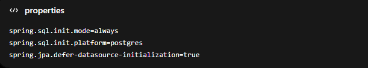

**Docker with postgres setup**  

1.spring.sql.init.mode=always

This tells Spring Boot:
Always execute SQL initialization scripts during startup

Typically these files are:
schema.sql
data.sql

from:
src/main/resources/

2.spring.sql.init.platform=postgres

This allows platform-specific SQL scripts.
Spring Boot will look for:   
schema-postgres.sql 
data-postgres.sql

instead of generic:   
schema.sql
data.sql

3.spring.jpa.defer-datasource-initialization=true

VERY important with Hibernate + schema.sql together.
This tells Spring Boot:
Wait for Hibernate/JPA initialization before executing SQL scripts

#############################

**Clean docker data**

#############################

Step 1 — Clean Docker properly

Run these first.

Remove stopped containers

docker container prune -f

Remove unused images

docker image prune -a -f

Remove unused volumes

docker volume prune -f

Remove unused networks

docker network prune -f

Nuclear cleanup

WARNING:

Deletes almost everything unused.

docker system prune -a --volumes -f

Step 2 — Check actual Docker usage

Run:

docker system df

This shows:

image usage
volume usage
build cache

Best Practice for Spring Boot Learning

Avoid:

too many tagged images
repeated docker build
dangling layers

Use:

docker compose down

docker system prune -f